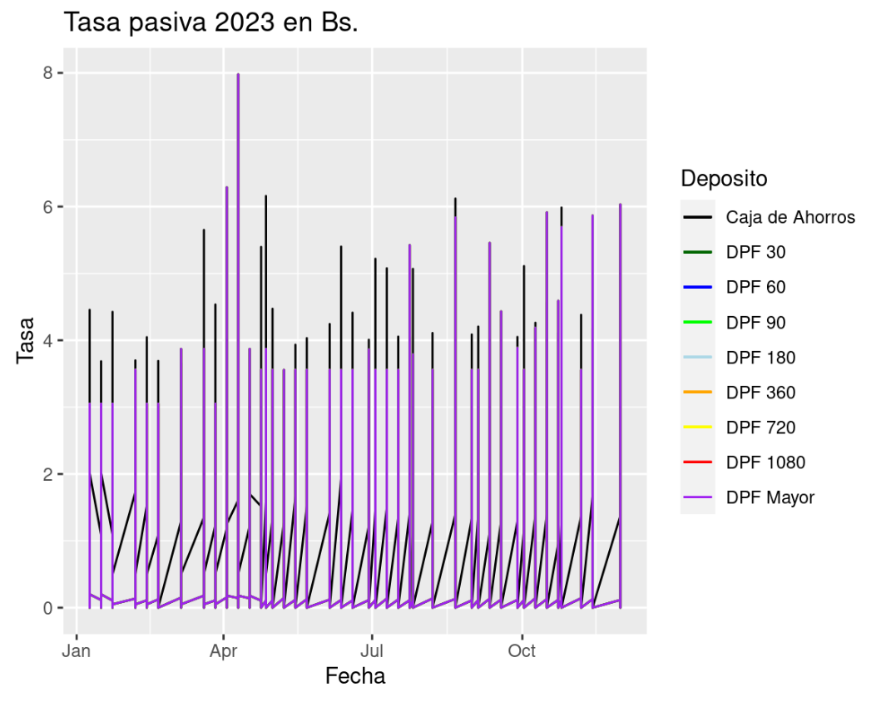

```{r load_libraries, results='hide', message=FALSE, warning=FALSE, echo=FALSE} 
library(ggplot2)
library(kableExtra)
library(dplyr)
```

# Introducción

# Objetivos

## Objetivo principal

Realizar un análisis de las tasas de interés activa y pasiva en el sistema financiero boliviano mediante el uso de series temporales, con el propósito de identificar tendencias a lo largo del tiempo, patrones estacionales y factores determinantes clave que contribuyan a la toma de decisiones informada para los ahorristas y prestatarios. 

## Objetivos específicos

- Identificar y recopilar datos históricos de las tasas de interés activa y pasiva en el sistema financiero boliviano, asegurando la disponibilidad de series temporales relevantes para el análisis.

- Aplicar técnicas estadísticas y métodos de análisis de series temporales para identificar y caracterizar tendencias a lo largo del tiempo en las tasas de interés activa y pasiva, con el objetivo de comprender su evolución histórica.

- Analizar factores determinantes clave que influyen en las tasas de interés activa y pasiva, tales como condiciones económicas, políticas monetarias, y otros indicadores financieros relevantes, para proporcionar una comprensión profunda de los impulsores de las variaciones observadas.

- Evaluar el impacto de las tendencias identificadas, patrones estacionales y factores determinantes en las decisiones financieras de ahorristas y prestatarios, proporcionando criterios de decisión que contribuyan a la toma de decisiones informada por parte de estos actores en el sistema financiero.

- Presentar de manera clara y accesible los hallazgos del análisis, a través de informes y visualizaciones, con el propósito de facilitar la comprensión y utilización de la información por parte de ahorristas, prestatarios y otras partes interesadas.


# Motivación

La importancia de este análisis radica en su capacidad para ofrecer una visión holística de cómo las tasas de interés han evolucionado históricamente, permitiendo anticipar posibles cambios y ayudando a los individuos y empresas a tomar decisiones financieras.

Visualizar información financiera de las tasas de interés al momento de considerar la adquisición de un crédito o la realización de un deposito a plazo fijo.

# Marco Teórico

### Tasas de interés activa

Las tasas de interés activas se refieren a los costos que los prestatarios incurren al obtener un préstamo o crédito de una institución financiera. Estas tasas representan el porcentaje adicional que se agrega al capital prestado y que los prestatarios deben pagar como compensación al prestamista por el riesgo y el servicio de proporcionar los fondos. 

### Tipos de crédito 

El sistema financiero boliviano ofrece créditos en moneda nacional Bs. y extranjera USD
- Empresarial
- PYME
- Micro-crédito
- Consumo
- Vivienda

### Tasas de interés pasiva

Las tasas de interés pasivas se refieren a los rendimientos que las instituciones financieras ofrecen a los depositantes por dejar su dinero en cuentas de ahorro, cuentas corrientes, certificados de depósito u otros instrumentos financieros similares. Estas tasas representan el porcentaje de interés que los depositantes ganan sobre el monto de dinero que mantienen en una institución financiera.

En el trabajo se considera 

- Caja de ahorros
- Depósitos a plazo fijo (DPF)


# Descripción de la base de datos

Para la obtención de la base de datos se aplico web scrapping en la pagina de Banco Central de Bolivia https://www.bcb.gob.bo/?q=tasas_interes 

El BCB publica las tasas de interés activa y pasiva diariamente, semanalmente y anualmente, para la realización del trabajo se proceso por semanas desde Enero del año 2015 hasta el 20 de Noviembre de 2023

Se trabajo con las siguientes bases de datos

- Base de datos tasas de interés activa
- Base de datos tasas de interés pasiva
- Base de datos tasa de referencia TRE

## Base de datos tasas de interés activa (db_tasa_activa)

Numero de registros = 24683

|   |Variable         | Tipo de dato   | Descripción                                                     |
|---|-----------------|----------------|-----------------------------------------------------------------|
|1  |start_date       | Fecha          | Fecha inicial                                                   |
|2  |end_date         | Fecha          | Fecha final                                                     |
|3  |day              | Cualitativo    | Día del mes                                                     |
|4  |month            | Cualitativo    | Numero de mes                                                   |
|5  |year             | Cualitativo    | año                                                             |
|6  |categoria        | Cualitativo    | Categoría de la entidad financiera                              |
|7  |categoria1       | Cualitativo    | Subcategoria de la entidad financiera                           |
|8  |entidad          | Cualitativo    | Entidad financiera                                              |
|9  |mn_empresarial   | Cuantitativo   | Tasa de interés en moneda nacional para crédito empresarial     |
|10 |mn_pyme          | Cuantitativo   | Tasa de interés en moneda nacional para crédito PYME            |
|11 |mn_micro_credito | Cuantitativo   | Tasa de interés en moneda nacional para crédito micro crédito   |
|12 |mn_consumo       | Cuantitativo   | Tasa de interés en moneda nacional para crédito consumo         |
|13 |mn_vivienda      | Cuantitativo   | Tasa de interés en moneda nacional para crédito vivienda        |
|14 |me_empresarial   | Cuantitativo   | Tasa de interés en moneda extranjera para crédito empresarial   |
|15 |me_pyme          | Cuantitativo   | Tasa de interés en moneda extranjera para crédito PYME          |
|16 |me_micro_credito | Cuantitativo   | Tasa de interés en moneda extranjera para crédito micro crédito |
|17 |me_consumo       | Cuantitativo   | Tasa de interés en moneda extranjera para crédito consumo       |
|18 |me_viviend       | Cuantitativo   | Tasa de interés en moneda extranjera para crédito vivienda      |

## Base de datos tasas de interés pasiva (db_tasa_pasiva)

Numero de registros = 21784

|   |Variable         | Tipo de dato   | Descripción                                                     |
|---|-----------------|----------------|-----------------------------------------------------------------|
|1  |start_date       | Fecha          | Fecha inicial                                                   |
|2  |end_date         | Fecha          | Fecha final                                                     |
|3  |day              | Cualitativo    | Día del mes                                                     |
|4  |month            | Cualitativo    | Numero de mes                                                   |
|5  |year             | Cualitativo    | año                                                             |
|6  |categoria        | Cualitativo    | Categoría de la entidad financiera                              |
|7  |categoria1       | Cualitativo    | Subcategoria de la entidad financiera                           |
|8  |entidad          | Cualitativo    | Entidad financiera                                              |
|9  |mn_caja_ahorro   | Cuantitativo   | Tasa de interés en moneda nacional para caja de ahorro          |
|10 |mn_dpf_30        | Cuantitativo   | Tasa de interés en moneda nacional para DPF 30 días             |
|11 |mn_dpf_60        | Cuantitativo   | Tasa de interés en moneda nacional para DPF 60 días             |
|12 |mn_dpf_90        | Cuantitativo   | Tasa de interés en moneda nacional para DPF 90 días             |
|13 |mn_dpf_180       | Cuantitativo   | Tasa de interés en moneda nacional para DPF 180 días            |
|14 |mn_dpf_360       | Cuantitativo   | Tasa de interés en moneda nacional para DPF 360 días            |
|15 |mn_dpf_720       | Cuantitativo   | Tasa de interés en moneda nacional para DPF 720 días            |
|16 |mn_dpf_1080      | Cuantitativo   | Tasa de interés en moneda nacional para DPF 1080 días           |
|17 |mn_dpf_mayor     | Cuantitativo   | Tasa de interés en moneda nacional para DPF mayor a 1080 días   |
|18 |me_caja_ahorro   | Cuantitativo   | Tasa de interés en moneda extranjera para caja de ahorro        |
|19 |mn_dpf_30        | Cuantitativo   | Tasa de interés en moneda extranjera para DPF 30 días           |
|20 |mn_dpf_60        | Cuantitativo   | Tasa de interés en moneda extranjera para DPF 60 días           |
|21 |mn_dpf_90        | Cuantitativo   | Tasa de interés en moneda extranjera para DPF 90 días           |
|22 |mn_dpf_180       | Cuantitativo   | Tasa de interés en moneda extranjera para DPF 180 días          |
|23 |mn_dpf_360       | Cuantitativo   | Tasa de interés en moneda extranjera para DPF 360 días          |
|24 |mn_dpf_720       | Cuantitativo   | Tasa de interés en moneda extranjera para DPF 720 días          |
|25 |mn_dpf_1080      | Cuantitativo   | Tasa de interés en moneda extranjera para DPF 1080 días         |
|26 |mn_dpf_mayor     | Cuantitativo   | Tasa de interés en moneda extranjera para DPF mayor a 1080 días |

## Base de datos tasas referencial TRE (db_tre)

Numero de registros = 244

|   |Variable      | Tipo de dato   | Descripción                 |
|---|--------------|----------------|-----------------------------|
|1  |start_date    | Fecha          | Fecha inicial               |
|2  |end_date      | Fecha          | Fecha final                 |
|5  |year          | Cualitativo    | año                         |
|6  |mn            | Cuantitativo   | Tasa TRE moneda nacional    |
|7  |me            | Cuantitativo   | Tasa TRE moneda extranjera  |


# Metodología

## Indicadores y fichas de Indicadores

1. Tasa de interés promedio para crédito de vivienda 
2. Tasa de interés promedio para crédito de micro-crédito

3. Tasa de interés promedio para cajas de ahorro en moneda nacional
4. Tasa de interés promedio para DPF a corto plazo
5. Tasa de interés promedio para DPF a mediano plazo
6. Tasa de interés promedio para DPF a largo plazo

7. Tasa de crecimiento de interés de activo para vivienda
8. Tasa de crecimiento de interés de pasivo para DPF corto plazo
9. Tasa de crecimiento de la TRE

10. Tasa crecimiento de oferta en crédito de vivienda
11. Tasa crecimiento de oferta en DPF de mediano plazo

## Tratamiento sobre la base de datos

Se realizaron las siguientes cambios para la preparación de la base de datos
- Las categorías provista para cada gestión tenían variación en ortográfica y palabras, las cuales se estandarizaron, ejemplo: se reemplazo "BANCOS MULTIPLES" por "BANCOS MÚLTIPLES"

- Se reemplazo valores faltantes por cero, la causa de este error fue en proceso de scrapping, debido a la versión de excel, algunos valores blancos se leyeron como strings.

- Los datos se guardaron en formato RData para su posterior uso en otros trabajos

## Visualización de la información

En la visualización se aplica series de tiempo para observar la evolución de las tasas activas así como también las tasas pasivas.

Debido a la cantidad de registros anuales es mejor visualizar las serie especificos al tipo de tasa, por ejemplo Figura 1




## Armado de la plataforma

Se aplica la herramienta flexboard para el dashboard y para la interactividad shiny

# Resultados y análisis

Luego de análisis de las tasas activas se observa poca variación en el transcurso de los 6 años, esto se debe principalmente que las tasa activas no consideran la tasa TRE que varia acorde a la inflación anual.

El análisis de las tasas pasivas muestra poca variación en el transcurso del tiempo, la tasa máxima para un DPF anual es de 8%, a la fecha 29 de Noviembre de 2023 la máxima es 6%.

# Conclusiones y recomendaciones

Aplicar scrapping web en la ingeniería de datos nos permitió obtener una base de datos de la tasas de interés, proveniente de una institución oficial como el BCB, el tratamiento de los datos nos permite obtener los datos de forma plana para facilitar el análisis.

Los criterios apriori de que las tasas pasivas no son atrayentes para los ahorritas se confirman, tanto para caja de ahorro (interés menor al 2%) como también para DPF (6% anual en promedio)

Se recomienda realizar un análisis por tasa de crédito asociado al tipo de entidad, para validar la oferta crediticia.

Adicionar la variación de la tasa TRE al crédito para observar el impacto de un crédito directo en el prestatario.

Restar a la tasa pasiva "Caja de ahorros" el IVA para marcar una diferencia real entre el DPF que el IVA no lo paga el ahorrista

# Referencias

- Banco Central de Bolivia https://www.bcb.gob.bo/
- Autoridad de Supervision del Sistema Financiero https://asfi.gob.bo/
- Codigo y Bases de datos https://github.com/1000ton/tasas-interes-bolivia


